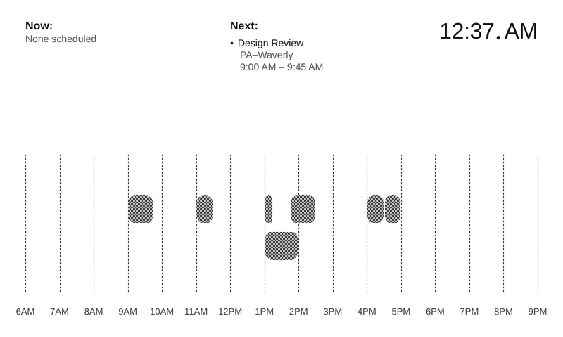

# eink_display
[](https://github.com/<OWNER>/<REPO>/actions/workflows/ci.yml)




Python application for driving a Waveshare 7.5" e-ink display with a daily calendar view rendered from Google Calendar data. The Node renderer now owns calendar fetching and HTML rendering; Python simply downloads the pre-rendered HTML document from the Node server's root path and pushes the rasterized result to the display driver. See [DESIGN.md](DESIGN.md) for the architectural plan.

## Configuration

Both the Node renderer and the Python wrapper read configuration from environment variables or an optional `.env` file in the working directory. At minimum, set the following values before starting the program:

| Variable | Description |
| --- | --- |
| `GOOGLE_CREDENTIALS_PATH` | Absolute path to the Google service account JSON used for Calendar API access. The file must exist when the Node renderer starts. |
| `CALENDAR_IDS` | Comma-separated list of Google Calendar IDs to display (e.g., `primary,team@example.com`). |

Example `.env` file:

```dotenv
GOOGLE_CREDENTIALS_PATH=/home/pi/secrets/service-account.json
CALENDAR_IDS=primary,team@example.com
```

## Development

- Review the contributor guidelines in [AGENTS.md](AGENTS.md) before making changes.
- Create and activate a virtual environment (e.g., `python -m venv .venv && source .venv/bin/activate`).
- Install development dependencies as needed (e.g., `pip install -r requirements-dev.txt` if using a shared requirements file).
- Configure the renderer preview directory (see below) to iterate on layouts without e-ink hardware attached.

### Running the renderer server

The Fastify/Puppeteer service fetches Google Calendar data and renders the calendar at its root path. Start it with your
credentials and calendar IDs, then open `http://localhost:${PORT:-3000}/` in a browser or let the Python code fetch the HTML from
that same URL:

```bash
cd eink_display/rendering/node_renderer
PUPPETEER_SKIP_DOWNLOAD=1 npm install
PORT=3000 CALENDAR_IDS=primary GOOGLE_CREDENTIALS_PATH=/path/to/creds.json npm run dev
```

When credentials are not available, the server falls back to bundled sample events so that previews and tests still render.
Python no longer posts custom event payloads; it simply downloads the rendered output from the server.

#### PNG endpoint and time overrides

The Fastify service still serves the HTML document at `/`, but now also provides a `/png` route that rasterizes the same layout
via Puppeteer. Both routes accept an optional `now=<ISO8601 timestamp>` query parameter so the client can control which
timestamp the calendar highlights (useful when the Pi's clock drifts from another machine). The `/png` route also accepts
`width`, `height`, and `dpr` overrides for debugging alternate resolutions.

#### Renderer performance tuning

The renderer runs headless Chromium and can be tuned for low-power hardware via environment variables:

- `PUPPETEER_EXECUTABLE_PATH`: point to a custom Chromium binary (e.g., `/usr/bin/chromium-headless-shell`).
- `PUPPETEER_HEADLESS`: set to `old` for older Chromium builds.
- `PUPPETEER_LIGHTWEIGHT`: set to `1` to disable background services, extensions, and networking overhead.
- `PUPPETEER_LAUNCH_TIMEOUT_MS`: increase the browser launch timeout (milliseconds).
- `PUPPETEER_WAIT_UNTIL`: override the page render wait condition (defaults to `domcontentloaded`).
- `PUPPETEER_WARMUP`: set to `1` to render a tiny frame on startup (avoids the first-request cold start).
- `RENDER_DEFAULT_DPR`: override the default device pixel ratio when no `dpr` query is provided.

### Rendering preview images

We now call the original React renderer directly via a small Fastify/Puppeteer service that ships with the repository
(`eink_display/rendering/node_renderer`). The Python helpers automatically install dependencies on first use, but you can also do
so manually:

```bash
cd eink_display/rendering/node_renderer
PUPPETEER_SKIP_DOWNLOAD=1 npm install
```

Render previews with the provided helper script, which saves whatever the Node server renders (live calendar data or the built-in sample events) to `previews/tufte_day_sample.png` by default:

```bash
python scripts/render_sample_calendar.py
```

Pass `--format html` to capture the raw markup instead (saves to `previews/tufte_day_sample.html` unless `--output` is provided) or override the server route with `--path /debug`. PNG captures hit the `/png` endpoint and mirror exactly what the device will display.

### Running the display loop

The `eink_display.app` module wires the scheduler, renderer client, and display driver together. Run it from the repository root:

```bash
python -m eink_display.app --start-node-server --display-driver mock --immediate
```

Useful flags:

- `--start-node-server`: launch the bundled Node service (otherwise the app connects to `NODE_RENDER_URL` or `http://127.0.0.1:3000`).
- `--display-driver {auto,waveshare,mock}`: choose the hardware backend; `--mock-output-dir` saves PNG frames for debugging.
- `--once` / `--immediate`: control scheduler behaviour for one-off renders or dev loops.
- `--node-timeout` / `--node-url`: tweak renderer connection details when managing the Node process separately.

### Running as a systemd service

A sample unit file lives at `systemd/eink-display.service`. Adjust the `User`, `Group`, `WorkingDirectory`, `EnvironmentFile`, and `ExecStart` paths to match your deployment (e.g., point `ExecStart` at the virtualenv you use). Then install and enable the service:

```bash
sudo cp systemd/eink-display.service /etc/systemd/system/
sudo systemctl daemon-reload
sudo systemctl enable --now eink-display.service
```

The unit loads environment variables from the `.env` file referenced in `EnvironmentFile`, so be sure that path is absolute and readable by the service user.

To verify the service and inspect logs:

```bash
sudo systemctl status eink-display.service
sudo journalctl -u eink-display.service -f
```

## Testing

Run the full automated test suite locally before opening a pull request:

```bash
pytest
```

The continuous integration workflow mirrors this command to help ensure consistent results.
